# Guía Completa de Despliegue en Producción - Grafo

**Versión:** 2.0.0
**Fecha:** 2025-01-21
**Plataforma:** Ubuntu/Linux con Docker

---

## 📋 Tabla de Contenidos

1. [Prerequisitos](#prerequisitos)
2. [Escenarios de Despliegue](#escenarios-de-despliegue)
3. [Opción A: MongoDB en Localhost (Recomendada)](#opción-a-mongodb-en-localhost-recomendada)
4. [Opción B: MongoDB desde DockerHub](#opción-b-mongodb-desde-dockerhub)
5. [Publicar a DockerHub](#publicar-a-dockerhub)
6. [Configuración de Nginx](#configuración-de-nginx)
7. [Troubleshooting](#troubleshooting)
8. [Comandos Útiles](#comandos-útiles)

---

## Prerequisitos

### Sistema Operativo
- **Ubuntu 20.04+ / Debian / Linux**
- MongoDB instalado en el mismo servidor (puerto 28101)

### Software Requerido
```bash
# Docker
docker --version    # 20.10+
docker compose version  # V2 (recomendado) o docker-compose V1

# Herramientas
curl
nc (netcat)
```

### Instalar Docker en Ubuntu
```bash
# Actualizar repositorios
sudo apt-get update

# Instalar dependencias
sudo apt-get install ca-certificates curl gnupg

# Agregar GPG key de Docker
sudo install -m 0755 -d /etc/apt/keyrings
curl -fsSL https://download.docker.com/linux/ubuntu/gpg | sudo gpg --dearmor -o /etc/apt/keyrings/docker.gpg
sudo chmod a+r /etc/apt/keyrings/docker.gpg

# Agregar repositorio de Docker
echo \
  "deb [arch=$(dpkg --print-architecture) signed-by=/etc/apt/keyrings/docker.gpg] https://download.docker.com/linux/ubuntu \
  $(. /etc/os-release && echo "$VERSION_CODENAME") stable" | \
  sudo tee /etc/apt/sources.list.d/docker.list > /dev/null

# Instalar Docker
sudo apt-get update
sudo apt-get install docker-ce docker-ce-cli containerd.io docker-buildx-plugin docker-compose-plugin

# Verificar instalación
docker --version
docker compose version

# Agregar usuario al grupo docker (opcional - evita usar sudo)
sudo usermod -aG docker $USER
# Cerrar sesión y volver a iniciar para aplicar cambios
```

### Verificar MongoDB
```bash
# Verificar que MongoDB esté corriendo en localhost:28101
nc -zv localhost 28101

# O con mongosh
mongosh "mongodb://localhost:28101/" --eval "db.adminCommand('ping')"
```

---

## Escenarios de Despliegue

### Escenario 1: MongoDB en el Mismo Servidor (Localhost) - ✅ RECOMENDADO

**Cuando usar:**
- MongoDB está instalado en el mismo servidor Ubuntu donde correrá Docker
- MongoDB escucha en `localhost:28101`

**Ventajas:**
- ✅ Conexión directa sin red externa
- ✅ Mejor rendimiento (sin overhead de red)
- ✅ Mayor seguridad (no expone MongoDB externamente)
- ✅ Más simple de configurar

**Usa:**
- `docker-compose.prod.localhost.yml`
- `scripts/deploy-prod-localhost.sh`

---

### Escenario 2: MongoDB desde DockerHub (Imágenes Pre-construidas)

**Cuando usar:**
- No quieres construir las imágenes localmente
- Quieres deployment rápido desde imágenes publicadas
- MongoDB sigue en localhost:28101

**Ventajas:**
- ✅ No requiere Node.js ni herramientas de build
- ✅ Deployment súper rápido
- ✅ Imágenes probadas y versionadas

**Usa:**
- `scripts/deploy-from-dockerhub.sh`

---

## Opción A: MongoDB en Localhost (Recomendada)

### Paso 1: Preparar el Entorno

```bash
# Crear directorio de deployment
mkdir -p /home/sonata/grafo/deployment
cd /home/sonata/grafo/deployment

# Clonar repositorio o copiar archivos necesarios
git clone https://github.com/tu-repo/grafo.git
cd grafo/Grafo

# O si transferiste el paquete tar.gz:
tar -xzf grafo-prod-*.tar.gz
cd grafo-prod-*
```

### Paso 2: Verificar Certificado TLS

```bash
# El certificado debe existir en Certs/prod/client.pem
ls -lh Certs/prod/client.pem

# Si no existe, copiarlo
mkdir -p Certs/prod
cp /ruta/al/client.pem Certs/prod/
```

### Paso 3: Ejecutar Deployment

```bash
# Hacer ejecutable el script
chmod +x scripts/deploy-prod-localhost.sh

# Ejecutar deployment
./scripts/deploy-prod-localhost.sh
```

El script hará automáticamente:
1. ✅ Verificar Docker y Docker Compose
2. ✅ Verificar conectividad a MongoDB (localhost:28101)
3. ✅ Verificar certificado TLS
4. ✅ Detener servicios existentes
5. ✅ Construir imágenes Docker
6. ✅ Iniciar servicios con `network_mode: host`
7. ✅ Verificar health de servicios
8. ✅ Mostrar estado y comandos útiles

### Paso 4: Verificar Servicios

```bash
# Query Service
curl http://localhost:9081/health
curl http://localhost:9081/docs  # Swagger UI

# MCP Server
curl http://localhost:8082/health

# Ver logs
docker compose -f docker-compose.prod.localhost.yml logs -f
```

### ⚠️ IMPORTANTE: Puertos con `network_mode: host`

Cuando usas `network_mode: host`, los contenedores **comparten la red del host**:

| Servicio | Puerto Configurado | Donde Escucha en el Host |
|----------|-------------------|--------------------------|
| Query Service | `SERVER_PORT=9081` | `localhost:9081` |
| MCP Server | `SERVER_PORT=8082` | `localhost:8082` |
| MongoDB | - | `localhost:28101` (ya existente) |

**NO se usa mapeo de puertos** (no hay `9081:9081`), los contenedores usan directamente los puertos del host.

---

## Opción B: MongoDB desde DockerHub

### Paso 1: Descargar Paquete de Deployment

```bash
# El paquete debe contener:
# - deploy-from-dockerhub.sh
# - Certs/prod/client.pem
# - diagnose-mongodb.sh
# - README.txt

cd /home/sonata/grafo/deployment
tar -xzf grafo-prod-YYYYMMDD-HHMMSS.tar.gz
cd grafo-prod-YYYYMMDD-HHMMSS
```

### Paso 2: Ejecutar Deployment

```bash
# Hacer ejecutable
chmod +x deploy-from-dockerhub.sh

# Ejecutar
./deploy-from-dockerhub.sh
```

El script:
1. ✅ Descarga imágenes de Docker Hub (`rlyehdoom/grafo-query:latest`, `rlyehdoom/grafo-mcp:latest`)
2. ✅ Crea configuración `.env.production`
3. ✅ Genera `docker-compose.dockerhub.yml` con `network_mode: host`
4. ✅ Inicia servicios
5. ✅ Genera configuración de Nginx

### Paso 3: Verificar

```bash
# Servicios
curl http://localhost:9081/health
curl http://localhost:8082/health

# Ver logs
docker compose -f docker-compose.dockerhub.yml --env-file .env.production logs -f
```

---

## Publicar a DockerHub

### Prerequisito: Cuenta en Docker Hub

1. Crear cuenta en https://hub.docker.com
2. Crear dos repositorios:
   - `tu-usuario/grafo-query`
   - `tu-usuario/grafo-mcp`

### Configurar Credenciales

```bash
cd Grafo/Query

# Editar .env con tus credenciales
cat > .env <<EOF
# Docker Hub Configuration
DOCKER_REGISTRY=docker.io
DOCKER_USERNAME=tu-usuario
DOCKER_PASSWORD=          # Dejar vacío, se solicitará interactivamente
DOCKER_REPO_QUERY=tu-usuario/grafo-query
DOCKER_REPO_MCP=tu-usuario/grafo-mcp
DOCKER_TAG=latest
EOF
```

### Publicar Imágenes

```bash
cd Grafo

# Publicar con el CLI de Grafo
grafo query push
```

El comando:
1. 🔐 Solicita contraseña de Docker Hub
2. 🔨 Construye ambas imágenes
3. 🏷️ Las etiqueta correctamente
4. 📤 Las sube a Docker Hub

### Verificar Publicación

```bash
# En otro servidor, probar pull
docker pull tu-usuario/grafo-query:latest
docker pull tu-usuario/grafo-mcp:latest
```

### Actualizar Scripts de Deployment

Editar `scripts/deploy-from-dockerhub.sh` para usar tus imágenes:

```bash
# Cambiar estas líneas:
DOCKER_REPO_QUERY="tu-usuario/grafo-query"
DOCKER_REPO_MCP="tu-usuario/grafo-mcp"
```

---

## Configuración de Nginx

### Opción 1: Auto-generación (Recomendado)

El script de deployment puede generar la configuración automáticamente:

```bash
# Durante el deployment, responder "y" cuando pregunte:
¿Deseas generar la configuración de Nginx? (y/N): y

# Se creará nginx-grafo-localhost.conf
```

### Opción 2: Configuración Manual

```bash
# Copiar configuración generada
sudo cp nginx-grafo-localhost.conf /etc/nginx/conf.d/grafo.conf

# O incluirla en tu server block existente
sudo nano /etc/nginx/sites-available/tu-sitio.conf
```

**Agregar:**
```nginx
server {
    listen 80;
    server_name tu-dominio.com;

    # Incluir configuración de Grafo
    include /path/to/nginx-grafo-localhost.conf;

    # ... resto de tu configuración
}
```

### Aplicar Configuración

```bash
# Verificar sintaxis
sudo nginx -t

# Recargar Nginx
sudo systemctl reload nginx
```

### URLs Públicas

Después de configurar Nginx:

| Servicio | URL Pública |
|----------|-------------|
| Query API | `https://tu-dominio.com/api/grafo/query/` |
| MCP SSE | `https://tu-dominio.com/api/grafo/mcp/sse` |
| Swagger UI | `https://tu-dominio.com/grafo/docs` |
| Query Health | `https://tu-dominio.com/grafo/query/health` |
| MCP Health | `https://tu-dominio.com/grafo/mcp/health` |

---

## Troubleshooting

### MongoDB Connection Failed

**Síntoma:**
```
pymongo.errors.ServerSelectionTimeoutError: localhost:28101
```

**Solución:**

1. **Verificar que MongoDB esté corriendo:**
```bash
sudo systemctl status mongod
nc -zv localhost 28101
```

2. **Verificar bind address en MongoDB:**
```bash
# Editar /etc/mongod.conf
sudo nano /etc/mongod.conf

# Debe tener:
net:
  port: 28101
  bindIp: 127.0.0.1,0.0.0.0  # Para localhost + acceso externo
  # O solo:
  bindIp: 127.0.0.1  # Solo localhost

# Reiniciar MongoDB
sudo systemctl restart mongod
```

3. **Verificar firewall:**
```bash
# Ver reglas
sudo ufw status

# Si es necesario, permitir puerto
sudo ufw allow 28101/tcp
```

4. **Usar script de diagnóstico:**
```bash
chmod +x diagnose-mongodb.sh
sudo ./diagnose-mongodb.sh
```

---

### Contenedor No Puede Acceder a MongoDB Localhost

**Síntoma:**
```
Error: getaddrinfo ENOTFOUND localhost
```

**Causa:** En Linux, `localhost` dentro de un contenedor Docker con red bridge apunta al contenedor, no al host.

**Solución:** Usar `network_mode: host` (ya implementado en los scripts)

---

### Puerto Ya en Uso

**Síntoma:**
```
Error: bind: address already in use
```

**Solución:**

1. **Ver qué está usando el puerto:**
```bash
sudo lsof -i :9081
sudo lsof -i :8082
```

2. **Detener servicio conflictivo:**
```bash
# Si es otro contenedor Docker
docker ps
docker stop <container-id>

# Si es otro proceso
sudo kill <PID>
```

---

### Certificado TLS No Encontrado

**Síntoma:**
```
Error: Certificate not found: ./Certs/prod/client.pem
```

**Solución:**
```bash
# Verificar ubicación
ls -lh ./Certs/prod/client.pem

# Si no existe, copiar
mkdir -p ./Certs/prod
cp /ruta/correcta/client.pem ./Certs/prod/
```

---

### Health Check Falla

**Síntoma:**
```
⚠️ Query Service no responde - verificar logs
```

**Solución:**

1. **Ver logs detallados:**
```bash
docker compose -f docker-compose.prod.localhost.yml logs query-service
```

2. **Verificar variables de entorno:**
```bash
docker inspect grafo-query-service-prod | grep -A 20 Env
```

3. **Verificar conectividad a MongoDB desde el contenedor:**
```bash
docker exec -it grafo-query-service-prod bash
curl http://localhost:28101/
```

---

## Comandos Útiles

### Gestión de Servicios

```bash
# Ver estado
docker compose -f docker-compose.prod.localhost.yml ps

# Ver logs (todos)
docker compose -f docker-compose.prod.localhost.yml logs -f

# Ver logs (un servicio)
docker compose -f docker-compose.prod.localhost.yml logs -f query-service
docker compose -f docker-compose.prod.localhost.yml logs -f mcp-server

# Reiniciar servicios
docker compose -f docker-compose.prod.localhost.yml restart

# Reiniciar un servicio específico
docker compose -f docker-compose.prod.localhost.yml restart query-service

# Detener servicios
docker compose -f docker-compose.prod.localhost.yml down

# Detener y eliminar volúmenes
docker compose -f docker-compose.prod.localhost.yml down -v
```

### Pruebas de API

```bash
# Health Check
curl http://localhost:9081/health
curl http://localhost:8082/health

# Buscar proyectos
curl -X POST http://localhost:9081/api/projects/search \
  -H "Content-Type: application/json" \
  -d '{"query": "Banking", "limit": 5}'

# Obtener contexto de código
curl -X POST http://localhost:9081/api/context/code \
  -H "Content-Type: application/json" \
  -d '{
    "file_path": "/path/to/file.cs",
    "class_name": "MyClass",
    "max_depth": 2
  }'

# Estadísticas
curl http://localhost:9081/api/context/statistics
```

### Monitoreo

```bash
# Ver uso de recursos
docker stats

# Ver uso de un contenedor específico
docker stats grafo-query-service-prod

# Ver puertos usados
docker port grafo-query-service-prod
docker port grafo-mcp-server-prod
```

### Limpieza

```bash
# Eliminar contenedores detenidos
docker container prune

# Eliminar imágenes no usadas
docker image prune

# Eliminar todo (cuidado!)
docker system prune -a
```

---

## Flujo Completo de Deployment

### Desarrollo → Producción

```mermaid
graph LR
    A[Desarrollo Local] --> B[Construir Imágenes]
    B --> C{Publicar?}
    C -->|Sí| D[Push a DockerHub]
    C -->|No| E[Transferir Archivos]
    D --> F[Deploy desde DockerHub]
    E --> G[Deploy Local Build]
    F --> H[Verificar Servicios]
    G --> H
    H --> I[Configurar Nginx]
    I --> J[Monitorear]
```



### 1. En Tu Máquina de Desarrollo

```bash
cd Grafo

# Opción A: Publicar a DockerHub
grafo query push

# Opción B: Crear paquete para transferir
./scripts/package-for-deployment.sh
# Esto crea: grafo-prod-YYYYMMDD-HHMMSS.tar.gz
```

### 2. Transferir al Servidor

```bash
# Desde tu máquina local
scp grafo-prod-*.tar.gz user@tu-servidor:/home/sonata/ftp/
```

### 3. En el Servidor de Producción

```bash
# Copiar desde FTP
mkdir -p /home/sonata/grafo/deployment
cp /home/sonata/ftp/grafo-prod-*.tar.gz /home/sonata/grafo/deployment/
cd /home/sonata/grafo/deployment

# Extraer
tar -xzf grafo-prod-*.tar.gz
cd grafo-prod-*

# Opción A: Deploy desde DockerHub (si publicaste)
./deploy-from-dockerhub.sh

# Opción B: Deploy con build local
./scripts/deploy-prod-localhost.sh
```

### 4. Verificar y Configurar

```bash
# Verificar servicios
curl http://localhost:9081/health
curl http://localhost:8082/health

# Configurar Nginx (si es necesario)
sudo cp nginx-grafo-localhost.conf /etc/nginx/conf.d/grafo.conf
sudo nginx -t
sudo systemctl reload nginx
```

---

## Seguridad

### Recomendaciones

1. **Firewall:**
```bash
# Solo permitir tráfico necesario
sudo ufw allow 80/tcp   # HTTP
sudo ufw allow 443/tcp  # HTTPS
sudo ufw allow 22/tcp   # SSH

# NO exponer puertos de servicio directamente
# (9081, 8082) - solo a través de Nginx
```

2. **Certificados TLS:**
```bash
# Proteger certificado
chmod 600 Certs/prod/client.pem
```

3. **Variables de Entorno:**
```bash
# No commitear .env.prod con credenciales
# Usar variables de entorno del sistema o secrets management
```

4. **Updates:**
```bash
# Actualizar regularmente
docker compose pull
docker compose up -d
```

---

## Soporte

### Logs

Todos los logs están en:
```bash
# Docker logs
docker compose -f docker-compose.prod.localhost.yml logs

# Nginx logs
/var/log/nginx/access.log
/var/log/nginx/error.log

# MongoDB logs
/var/log/mongodb/mongod.log
```

### Contacto

- Issues: https://github.com/tu-repo/grafo/issues
- Documentación: `Grafo/README.md`

---

**Guía actualizada:** 2025-01-21
**Versión Grafo:** 1.0.0
