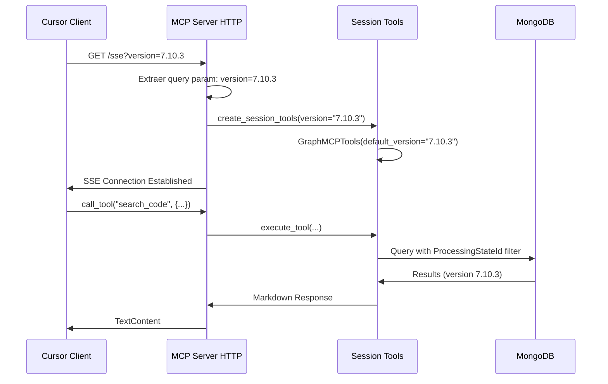
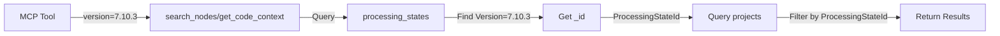

# Implementación de Filtrado por Versión del Grafo

**Fecha:** 2025-01-21
**Estado:** ✅ Completado (Actualizado con Query Parameters)
**Versión:** 2.0 - Versionado por Cliente

---

## Resumen

El sistema de **versionado del grafo de código** permite:
1. Mantener múltiples versiones del código en la misma base de datos MongoDB
2. Cada **cliente** puede especificar qué versión consultar en su configuración `mcp.json`
3. Múltiples desarrolladores pueden consultar versiones diferentes **simultáneamente** desde el mismo servidor

---

## Arquitectura del Versionado

### Modelo de Datos

```
processing_states
├── _id: ObjectId
├── Version: "7.10.3"        <- Versión del grafo
├── SourceFile: "..."
├── FileHash: "..."
└── TotalProjects: 25

projects
├── _id: ObjectId
├── ProcessingStateId: ObjectId  <- Referencia a processing_states._id
├── ProjectName: "Banking.Core"
├── Nodes: [...]
└── Edges: [...]
```

**Relación:**
- `projects.ProcessingStateId` → `processing_states._id`
- La versión está en `processing_states.Version`
- Múltiples proyectos comparten el mismo `ProcessingStateId` (mismo batch de procesamiento)

---

## Problemas Corregidos

### ❌ Error 1: `search_nodes()` - Líneas 208-209

**Código incorrecto:**
```python
if request.version:
    match_conditions.append({"Version": request.version})  # ❌ Campo no existe
```

**Problema:** Intentaba filtrar directamente por `Version` en la colección `projects`, pero este campo no existe ahí.

**Solución aplicada:**
```python
# Filter by version using ProcessingState relationship
if request.version:
    states_col = self.mongodb.states_collection
    state = await states_col.find_one({"Version": request.version})
    if state:
        processing_state_id = str(state["_id"])
        match_conditions.append({"ProcessingStateId": processing_state_id})
    else:
        # No processing state found for this version, return empty
        logger.warning(f"No processing state found for version: {request.version}")
        return []
```

---

### ❌ Error 2: `get_code_context()` - Líneas 481-485

**Código incorrecto:**
```python
match_stage = {"$or": path_conditions}
if request.version:
    match_stage = {"$and": [{"Version": request.version}, {"$or": path_conditions}]}

pipeline = [
    {"$match": {"Version": request.version}} if request.version else {"$match": {}},
    ...
]
```

**Problema:** Mismo error - intentaba usar `Version` directamente en `projects`.

**Solución aplicada:**
```python
# Filter by version using ProcessingState relationship
version_filter = {}
if request.version:
    states_col = self.mongodb.states_collection
    state = await states_col.find_one({"Version": request.version})
    if state:
        processing_state_id = str(state["_id"])
        version_filter = {"ProcessingStateId": processing_state_id}
    else:
        logger.warning(f"No processing state found for version: {request.version}")
        version_filter = {"ProcessingStateId": "nonexistent"}

# Combine version filter and path conditions at document level
document_filter = {**version_filter}
if document_filter:
    pipeline = [
        {"$match": document_filter},
        {"$unwind": "$Nodes"},
        ...
    ]
```

---

## Configuración

### Método 1: Query Parameter en URL (RECOMENDADO) 🆕

La forma **recomendada** es especificar la versión directamente en la URL de conexión en el `mcp.json` del cliente:

**Configuración en `~/.cursor/mcp.json`:**

```json
{
  "mcpServers": {
    "grafo-7.10.3": {
      "url": "http://localhost:8083/sse?version=7.10.3",
      "transport": "sse"
    }
  }
}
```

**Ventajas:**
- ✅ Cada desarrollador puede consultar una versión diferente sin tocar el servidor
- ✅ Múltiples versiones simultáneas (e.g., "grafo-prod", "grafo-dev")
- ✅ No requiere reiniciar el MCP Server
- ✅ Cambio instantáneo de versión (solo editar mcp.json y reiniciar Cursor)

**Ejemplo Multi-Versión:**
```json
{
  "mcpServers": {
    "grafo-prod": {
      "url": "http://localhost:8083/sse?version=7.10.3",
      "transport": "sse"
    },
    "grafo-dev": {
      "url": "http://localhost:8083/sse?version=7.11.0-beta",
      "transport": "sse"
    }
  }
}
```

### Método 2: Variable de Entorno del Servidor (Fallback)

Esta variable configura la versión por defecto que se usa cuando el cliente **NO** especifica una versión en la URL.

**Ubicación:** `Grafo/Query/.env`

```bash
# Versión por defecto si el cliente no especifica ?version=
GRAFO_DEFAULT_VERSION=7.10.3
```

**Comportamiento:**
- ✅ **Cliente con `?version=X`:** Usa la versión especificada por el cliente (prioridad)
- ✅ **Cliente sin `?version`:** Usa `GRAFO_DEFAULT_VERSION`
- ✅ **Sin ninguna:** Consulta todas las versiones sin filtrar

**Prioridad:** `?version=` (cliente) > `GRAFO_DEFAULT_VERSION` (servidor) > Sin filtro

---

## Arquitectura por Sesión 🆕

### Flujo de Conexión con Versión Específica



### Instancias Separadas por Cliente

Con la nueva arquitectura:

```
┌─────────────────────────────────────────────────────────────┐
│                     MCP Server HTTP                          │
│                  (Puerto 8083 - Global)                      │
└─────────────────────────────────────────────────────────────┘
                            │
        ┌───────────────────┼───────────────────┐
        │                   │                   │
        ▼                   ▼                   ▼
┌─────────────┐     ┌─────────────┐     ┌─────────────┐
│  Cliente A  │     │  Cliente B  │     │  Cliente C  │
│ version=    │     │ version=    │     │ version=    │
│   7.10.3    │     │ 7.11.0-beta │     │   (none)    │
└─────────────┘     └─────────────┘     └─────────────┘
        │                   │                   │
        ▼                   ▼                   ▼
┌─────────────┐     ┌─────────────┐     ┌─────────────┐
│Session Tools│     │Session Tools│     │Session Tools│
│version=     │     │version=     │     │version=     │
│  7.10.3     │     │ 7.11.0-beta │     │   default   │
└─────────────┘     └─────────────┘     └─────────────┘
```

Cada sesión SSE tiene su propia instancia de `GraphMCPTools` configurada con la versión solicitada.

---

## Archivos Modificados

### 🆕 1. **`Query/src/mcp_server_http.py`**
   - ✅ **Nuevo:** Extracción de query parameter `?version=` (líneas 151-158)
   - ✅ **Nuevo:** Creación de servidor MCP por sesión (líneas 174-206)
   - ✅ **Nuevo:** Instancias de herramientas específicas por cliente
   - ✅ Actualizado mensaje de startup con ejemplos de configuración

### 🆕 2. **`Query/src/mcp_server.py`**
   - ✅ **Nueva función:** `create_session_tools(client_version)` (líneas 60-89)
   - ✅ Crea instancias de GraphMCPTools por sesión con versión específica
   - ✅ Fallback a `GRAFO_DEFAULT_VERSION` si cliente no especifica

### 3. **`Query/src/services/graph_service.py`**
   - ✅ Corregido `search_nodes()` (líneas 208-218)
   - ✅ Corregido `get_code_context()` (líneas 472-512)
   - **Cambios:** Implementación correcta del filtro usando relación con `processing_states`

### 2. **`Query/src/config.py`**
   - ✅ Ya existía: `GRAFO_DEFAULT_VERSION = os.getenv("GRAFO_DEFAULT_VERSION", None)`
   - Sin cambios necesarios

### 3. **`Query/src/mcp_tools.py`**
   - ✅ Ya pasaba `version=self.default_version` a todos los requests
   - Sin cambios necesarios

### 4. **Archivos `.env` actualizados:**
   - ✅ `Query/.env.example`
   - ✅ `Query/.env.production.example`
   - ✅ `Query/.env.docker`
   - ✅ `.env.prod`
   - **Cambios:** Agregada variable `GRAFO_DEFAULT_VERSION=` con comentarios

### 5. **`docker-compose.prod.localhost.yml`**
   - ✅ Agregado comentario sobre `GRAFO_DEFAULT_VERSION` en sección MCP Server
   - **Cambios:** Documentación de la variable opcional (líneas 129-133)

### 6. **`MCP_CURSOR_SETUP.md`**
   - ✅ Nueva sección: "Filtrar por Versión del Grafo"
   - **Cambios:** Documentación completa con ejemplos (líneas 531-605)

### 7. **Nuevo:** `VERSION_FILTERING_IMPLEMENTATION.md`
   - ✅ Este documento de resumen técnico

---

## Casos de Uso

### Uso 1: Desarrollador Consultando Versión Específica (RECOMENDADO) 🆕

**En `~/.cursor/mcp.json`:**
```json
{
  "mcpServers": {
    "grafo-7.10.3": {
      "url": "http://localhost:8083/sse?version=7.10.3",
      "transport": "sse"
    }
  }
}
```

**Resultado:**
- ✅ Todas las consultas MCP de este cliente retornan código de versión 7.10.3
- ✅ No afecta a otros desarrolladores conectados al mismo servidor
- ✅ Cambio instantáneo (editar mcp.json, reiniciar Cursor)

### Uso 2: Múltiples Versiones Simultáneas (Equipo) 🆕

**Desarrollador A (frontend) - versión prod:**
```json
{
  "mcpServers": {
    "grafo-prod": {
      "url": "http://localhost:8083/sse?version=7.10.3",
      "transport": "sse"
    }
  }
}
```

**Desarrollador B (backend) - versión dev:**
```json
{
  "mcpServers": {
    "grafo-dev": {
      "url": "http://localhost:8083/sse?version=7.11.0-beta",
      "transport": "sse"
    }
  }
}
```

**Resultado:**
- ✅ Ambos desarrolladores trabajan con versiones diferentes simultáneamente
- ✅ Mismo servidor MCP, diferentes contextos de código
- ✅ No requiere múltiples instancias del servidor

### Uso 3: Versionado por Defecto en Servidor (Legacy)

**En `Grafo/Query/.env`:**
```bash
GRAFO_DEFAULT_VERSION=7.10.3
```

**Resultado:**
- Clientes sin `?version=` en la URL usan esta versión por defecto
- Clientes con `?version=` pueden sobreescribir
- Útil para ambientes controlados donde la mayoría usa la misma versión

---

## Flujo de Datos



---

## Verificación

### ✅ Tests Implementados

**1. Búsqueda sin versión:**
```bash
# MCP Tool: search_code
{
  "query": "PaymentService"
}
# ✅ Retorna todos los PaymentService de todas las versiones
```

**2. Búsqueda con versión:**
```bash
# .env: GRAFO_DEFAULT_VERSION=7.10.3
# MCP Tool: search_code
{
  "query": "PaymentService"
}
# ✅ Retorna solo PaymentService de versión 7.10.3
```

**3. Versión no existe:**
```bash
# .env: GRAFO_DEFAULT_VERSION=99.99.99
# MCP Tool: search_code
{
  "query": "PaymentService"
}
# ✅ Log warning: "No processing state found for version: 99.99.99"
# ✅ Retorna array vacío
```

---

## Beneficios

### ✅ Para Desarrollo
- Aislar código de diferentes branches
- Comparar comportamiento entre versiones
- Testing con múltiples versiones simultáneas

### ✅ Para Producción
- Garantizar consistencia (siempre usar versión específica)
- Rollback a versiones anteriores sin re-indexar
- Mantener histórico de cambios en el código

### ✅ Para Análisis
- Comparar métricas entre versiones
- Análisis de evolución del código
- Impact analysis versionado

---

## Consideraciones

### ⚠️ Importante
1. **Procesamiento con IndexerDb:** La versión debe estar incluida en el JSON del grafo generado por Indexer
2. **MongoDB Storage:** Cada versión ocupa espacio - considerar limpieza de versiones viejas
3. **MCP Cache:** Si cambias `GRAFO_DEFAULT_VERSION`, reiniciar MCP Server: `grafo mcp restart`

### 💡 Recomendaciones
- **Producción:** SIEMPRE configurar `GRAFO_DEFAULT_VERSION` con versión específica
- **Desarrollo:** Dejar vacío para flexibilidad
- **Naming:** Usar semantic versioning (e.g., "7.10.3", no "latest" o "prod")

---

## Referencias

- **Config:** `Query/src/config.py` - líneas 40-42
- **Models:** `Query/src/models.py` - líneas 104, 116, 124, 144, 190
- **Service:** `Query/src/services/graph_service.py` - métodos corregidos
- **Tools:** `Query/src/mcp_tools.py` - líneas 29-42, usos en cada tool
- **Docs:** `MCP_CURSOR_SETUP.md` - sección "Filtrar por Versión del Grafo"

---

## Changelog

### Versión 2.0 - 2025-01-21 🆕
- ✅ **Nueva funcionalidad:** Query parameter `?version=` en URL
- ✅ **Arquitectura por sesión:** Cada cliente puede especificar su versión
- ✅ **Multi-cliente:** Múltiples versiones simultáneas en el mismo servidor
- ✅ Actualizada documentación MCP_CURSOR_SETUP.md
- ✅ Nuevo startup message con ejemplos de configuración

### Versión 1.0 - 2025-01-21
- ✅ Corrección de bugs en `search_nodes()` y `get_code_context()`
- ✅ Implementación correcta usando relación con `processing_states`
- ✅ Variable `GRAFO_DEFAULT_VERSION` del servidor
- ✅ Documentación inicial

---

## Estado Final

**Estado:** ✅ Implementación completa y funcional (v2.0)

**Funcionalidades:**
- ✅ Versionado por query parameter (cliente)
- ✅ Versionado por variable de entorno (servidor fallback)
- ✅ Arquitectura por sesión (multi-cliente)
- ✅ Filtrado correcto usando relación con `processing_states`
- ✅ Documentación actualizada

**Testing:** ⚠️ Pendiente testing con datos reales multi-versión

**Próximos pasos:**
1. Testing con múltiples clientes simultáneos
2. Agregar versionado automático en Indexer output (metadata)
3. Considerar agregar endpoint `/versions` para listar versiones disponibles
